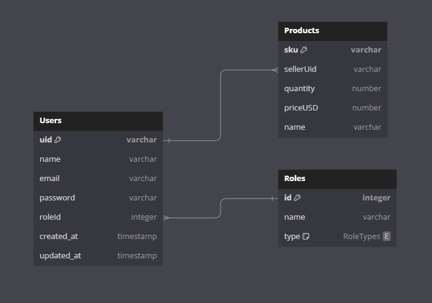

# Back Market Place App

## DB DESIGN DIAGRAM



## Installation

### Follow these steps to correctly run the app. Execute these commands in your favorite terminal.

### 1-. Clone the [Repository](https://github.com/LuisGerar321/market-place-back.git) in your preferred folder e.g. "/home/luis"

```
git clone https://github.com/LuisGerar321/market-place-back.git
```

### 2-. Install the modules required to run the project:

```
cd market-place-back
npm i
```

### 3-. Configure Server-Side (Backend)

### In the server folder 'market-place-back', create a new file named '.env' and paste the following environment variables to properly run the backend:

```
#API Version
API_VERSION = "v1"

#Server Config
SERVER_PORT = 3001
SERVER_HOST = "localhost"


#Database Configuration
DB_HOST = "localhost"
DB_NAME = "postgres"
DB_USER_NAME = "postgres"
DB_PASS = "raspberry"


# JWT
JWT_SECRET_KEY =  "nodejs-magic-log"
```

#### Customize the variables as needed by inserting your API key.

## Testing the app in dev

### Run

```
npm run dev

```

## Test App in production

### Play with the app with the following [link](http://reactbuckes3.s3-website-us-west-1.amazonaws.com/store) and SignIn with this custom credentials or create your account.

### Admin

```
  "email": "admin@system.com",
  "password": "adminadmin",
```

### Admin

```
  "email": "mariana@gmail.com",
  "password": "123",
```
